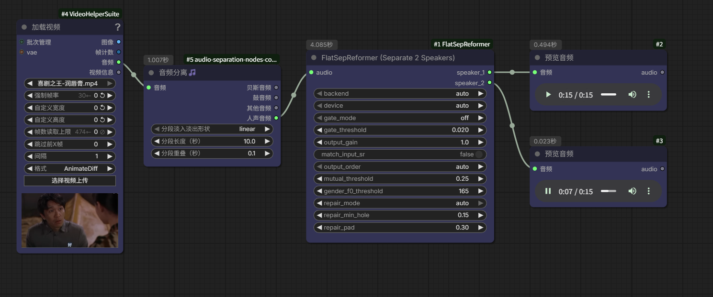

# ComfyUI-FlatSepReformer

[FLASepformer](https://modelscope.cn/models/iic/speech_flatsepreformer_separation_temporal_8k_base_libri2mix100)
（FLA-SepReformer-B）双说话人语音分离模型的 **ComfyUI 自定义节点**。

模型在 Libri2Mix-100 上训练，用于 **8 kHz 单声道双说话人语音分离**：
输入一段两人混合语音，输出两路独立的说话人语音。

> 模型许可证：CC BY-NC 4.0（非商业用途）。模型权重不随本仓库分发，
> 首次运行节点时会**自动下载**，也可用下方三种方式之一手动获取。



---

## ✨ 特性

- 🎛 **3 个即插即用节点**：分离节点已合并"模型加载 + 语音分离"，开箱即用
- 🎚 **固定 speaker_1 的输出排序（output_order）**：模型是置换不变训练（PIT），
  原始输出哪路对应谁不固定。节点自动按"语音质量分 + 基频性别检测"重排：
  `auto` 保证 speaker_1 一定是较正常的人声（质量优先），质量接近时女声固定到
  speaker_1；也可强制 `female`（女声固定 spk1）/ `quality`（仅按质量）/ `as_is`
- 🎚 **互斥门控（gate_mode=mutual）**：专治两人轮流说话的交替对话（如影视对白）——
  逐帧比较两路能量，某路明显占优时压低另一路的泄漏/串扰，两路都更干净；
  重叠说话段不误伤
- 🔧 **空洞修复（repair_mode=auto）**：模型对影视对白的弱音节（如"咦""唇""破"）
  常整体掩蔽丢弃，导致 speaker_1 丢字、内容跑进 speaker_2。开启后自动检测空洞、
  局部窗口重分离找回弱音节补回 speaker_1，并清理 speaker_2 重复；**音区校验 +
  句内延续校验**确保对方说话人的内容（男声）不会被误补进 spk1
- 🎯 **目标说话人提取（target_speaker=female/male，通用兜底）**：输入含背景音乐/
  哼唱、或两人音色接近导致模型把两个真人语音挤进同一路（另一路变成音乐/残渣）
  时，选 `female`/`male` 启用兜底管线：自动检测"混合语音路"→ 话语段谱质心聚类
  （男低女高，边界段用基频裁决）→ 把目标性别的**完整**话语段输出到 speaker_1，
  另一人输出到 speaker_2。检测不到混合语音路时自动回退正常分离逻辑，**不影响
  旧工作流任何行为**
- 🚀 **双推理后端（auto 自动选择）**：
  - `onnx`：使用 `onnx_model.onnx`，基于 ONNX Runtime，**无需安装 modelscope**（默认优先）
  - `modelscope`：使用 `pytorch_model.pt`（需 master 源码版）
- 📦 **模型自动定位**：默认读取 `<ComfyUI>/models/FlatSepReformer/`
  （基于插件位置的相对路径推导，无需填写任何路径）
- 🔄 **自动重采样**：任意采样率的输入音频自动重采样到 8000 Hz
- 💾 **模型缓存**：同一配置只加载一次，重复执行不重复占显存
- 🎚 **双后端输出一致**：ONNX 与 modelscope 后端均按峰值归一化到 0.5（与官方 pipeline 后处理一致），相关系数 > 0.9999
- 🎛 **可调后处理参数**：说话人活动门控（soft/hard/mutual 三档，改善交替对话/夹杂）、输出增益、输出采样率匹配

## 📦 安装

### 1. 克隆插件到 ComfyUI

```bash
cd <ComfyUI>/custom_nodes
git clone https://github.com/<你的用户名>/ComfyUI-FlatSepReformer.git
```

### 2. 安装 Python 依赖

```bash
cd ComfyUI-FlatSepReformer
# 建议使用 ComfyUI 的 python_embeded 环境（Windows: python_embeded\python.exe -m pip ...）
pip install -r requirements.txt
```

> ⚠️ ModelScope 后端要求 **最新 master 源码**（模型卡要求）：
>
> ```bash
> pip install -U "modelscope @ git+https://github.com/modelscope/modelscope.git@master"
> ```
>
> 如果只想用 `onnx` 后端，可跳过 modelscope。

### 3. 下载模型（三种方式任选其一）

模型文件需存放在目标文件夹：

> **目标文件夹：`<ComfyUI>/models/FlatSepReformer/`**
>
> 包含 3 个文件（共约 120 MB）：`configuration.json`、`pytorch_model.pt`、`onnx_model.onnx`

**方式 ①：ComfyUI 运行时自动下载（推荐，无需任何操作）**

节点**首次运行时**会自动检测目标文件夹；若模型不存在，自动从 ModelScope
下载到 `<ComfyUI>/models/FlatSepReformer/`，控制台会显示下载进度。

**方式 ②：夸克网盘下载**

网盘链接：https://pan.quark.cn/s/33060e1ee34c

下载解压后，把 `FlatSepReformer` 整个文件夹放到 `<ComfyUI>/models/` 目录下。

**方式 ③：魔塔（ModelScope）下载**

模型主页：https://modelscope.cn/models/iic/speech_flatsepreformer_separation_temporal_8k_base_libri2mix100

```bash
# 方式 3a：命令行下载
pip install modelscope
modelscope download --model iic/speech_flatsepreformer_separation_temporal_8k_base_libri2mix100 --local_dir <ComfyUI>/models/FlatSepReformer

# 方式 3b：代码下载
# python -c "from modelscope.hub.snapshot_download import snapshot_download; snapshot_download('iic/speech_flatsepreformer_separation_temporal_8k_base_libri2mix100', local_dir=r'<ComfyUI>/models/FlatSepReformer')"
```

也可在模型主页手动下载 `configuration.json`、`pytorch_model.pt`、`onnx_model.onnx`
三个文件放入目标文件夹。

> 提示：也可运行 `python install.py` 自动下载到默认位置；或设置环境变量
> `FLATSEPREFORMER_MODEL_DIR` 指向自定义目录。

### 4. 重启 ComfyUI

重启后在节点菜单 **`audio/separation`** 分类下即可看到全部节点。

## 🧩 节点说明

| 节点 | 输入 | 输出 | 说明 |
|---|---|---|---|
| **FlatSepReformer (Separate 2 Speakers)** | `audio`、`backend`、`device`、`output_order`、`gate_mode`、`gate_threshold`、`mutual_threshold`、`gender_f0_threshold`、`output_gain`、`match_input_sr`、`repair_mode`、`repair_min_hole`、`repair_pad`、`target_speaker` | `speaker_1`、`speaker_2` | **合并节点**：自动加载 `<ComfyUI>/models/FlatSepReformer` 模型并分离双说话人。`backend` 默认 `auto`（优先 onnx，无需 modelscope）。`output_order` 默认 `auto`（固定 speaker_1 = 较正常的人声，质量接近时女声优先）。`repair_mode=auto` 开启空洞修复（找回被模型吞掉的弱音节）。`target_speaker=female/male` 启用目标说话人提取兜底（见 v2.3） |
| **Load Audio (FlatSepReformer)** | `audio_path` | `audio` | 加载 wav/flac/ogg/mp3 等格式音频文件 |
| **Save Audio (FlatSepReformer)** | `audio`、`filename`、`output_dir` | `filepath` | 保存为 wav，返回保存路径（默认 `<ComfyUI>/output/`） |

> v2.3 变更：新增 `target_speaker=female/male` **目标说话人提取兜底**。当输入含
> 背景音乐/哼唱，或两人音色接近（如影视对白里 F0 高度重叠的男女声）时，模型
> 可能把两个真人语音挤进同一路、另一路变成音乐/残渣（常见现象：speaker_1 是
> 背景音、全部台词在 speaker_2）。此时选 `target_speaker=female`（或 `male`）：
> 节点自动检测"混合语音路"，对该路做 **VAD 切分 → 话语段谱质心聚类（男低女高，
> 边界段用基频裁决）→ 目标性别话语段拼接**，保证 speaker_1 输出**纯净且完整**
> 的目标性别语音、speaker_2 输出另一人。未检测到混合语音路时自动回退正常分离
> 逻辑，旧工作流行为完全不变（默认 `auto`）。

> v2.2 变更：新增 `repair_mode=auto` 空洞修复。模型对影视对白的弱音节（如
> "咦""唇""破"等）常直接掩蔽丢弃，导致 speaker_1 丢字/缺内容。开启后节点自动：
> 检测 spk1 静音空洞 → 以空洞为窗口重新分离（局部窗口的掩蔽模式与全段不同，
> 弱音节能保住）→ 经**音区校验 + 句内延续校验**确认是 spk1 说话人的内容后补回
> spk1，并同步清理 spk2 的重复；对方说话人的内容（男声）不会被误补进 spk1。

> v2.1 变更：新增 `output_order`（固定 speaker_1 的输出排序）与 `gate_mode=mutual`
> （互斥门控，交替对话专用）。**旧工作流不受影响**（新增参数都有默认值）。

> v2 变更：原 `FlatSepReformerLoader` + `FlatSepReformerSeparate` 两个节点已合并为
> `FlatSepReformerSeparate` 单节点（输入 `audio`，自动加载模型）。请删除工作流中旧的
> Loader 节点，直接用新的分离节点。

`AUDIO` 类型遵循社区通用约定：`{"waveform": torch.Tensor [B, C, T], "sample_rate": int}`，
可与其它音频节点（如 ComfyUI-Audio 生态）互相连接。

## 🚀 快速上手

1. **Load Audio**：填入混合语音 wav 路径（两人同时说话）
2. **Separate**：连接 audio，`backend` 留 `auto`、`device` 留 `auto` 即可（自动加载模型）
3. **Save Audio ×2**：分别接 `speaker_1`、`speaker_2`，设置文件名

`examples/workflow.json` 提供可直接导入的完整示例工作流（下图），包含：
**VHS_LoadVideo（读视频音轨）→ AudioSeparation（背景音消除，UVR 类模型）→
FlatSepReformerSeparate（`repair_mode=auto`）→ PreviewAudio ×2**。

> ⚠️ 该示例工作流使用第三方节点：`VHS_LoadVideo`（VideoHelperSuite）与
> `AudioSeparation`（audio-separation-nodes-comfyui），需先在 ComfyUI Manager 安装。
> 若不需要背景音消除，可直接用 **Load Audio** 节点把处理好的干净语音接入
> `FlatSepReformerSeparate`。


## ✅ 测试

```bash
cd ComfyUI-FlatSepReformer
python tests/smoke_test.py        # 端到端冒烟测试（需模型，覆盖 onnx/modelscope 双后端）
python tests/test_sorting_gate.py # 新增能力单元测试（无需模型：互斥门控/质量分/性别检测/排序）
```

冒烟测试覆盖：音频加载 → 模型加载（onnx + modelscope 双后端）→ 双说话人分离 → 音频保存 → 非 8k 输入自动重采样 → 互斥门控 + 输出排序。
测试通过标志：`ALL TESTS PASSED`。

## 🖥 后端选择建议

| 场景 | 推荐 backend |
|---|---|
| 默认（推荐） | `auto`：模型目录有 `onnx_model.onnx` 时自动用 onnx，无需 modelscope |
| 已安装 master 版 modelscope | `modelscope`（与 ModelScope 生态一致） |
| 只想用 PyTorch 权重 | `modelscope`（需先升级 modelscope，见常见问题） |

> ⚠️ 默认 `auto` 优先 ONNX，**完全不需要 modelscope**，可避免
> "`... is not in the pipelines registry group speech-separation`" 的版本问题。

## ⚙️ 模型目录与相对路径

节点通过**插件自身位置的相对路径**自动定位模型（不依赖工作目录、无需填绝对路径）：

```
<ComfyUI>/
├── models/
│   └── FlatSepReformer/          ← 模型目录（configuration.json / pytorch_model.pt / onnx_model.onnx）
└── custom_nodes/
    └── ComfyUI-FlatSepReformer/  ← 插件位置（相对推导 ../../models/FlatSepReformer）
```

如需自定义位置：环境变量 `FLATSEPREFORMER_MODEL_DIR`（优先级高于自动探测）。

```bash
# Windows PowerShell
$env:FLATSEPREFORMER_MODEL_DIR = "D:/models/FlatSepReformer"
# 重启 ComfyUI
```

## 🛠 常见问题

**Q: speaker_1 / speaker_2 输出的人不固定，有时 speaker_1 是杂音？**
这是模型的**置换不变训练（PIT）**特性：输出通道与说话人的对应关系不固定，且
交替对话（训练集为完全重叠语音）下不活跃通道会残留泄漏/杂音。节点已内置解法：
1. `output_order` 默认 `auto`：按语音质量排序，**质量好的固定为 speaker_1**，
   不会出现 speaker_1 是杂音；两路质量接近时女声自动固定到 speaker_1。
   想强制女声在 spk1 选 `female`，恢复旧行为选 `as_is`
2. `gate_mode=mutual`：交替对话推荐开启，逐帧压低另一路的泄漏，两路都更干净
3. 想固定"男声=spk2、女声=spk1"，保持 `output_order=auto` 即可（女声次级规则）；
   性别判定不准时可调 `gender_f0_threshold`（默认 165Hz）

**Q: 换了音频后男女声完全分不开，speaker_1 是音乐/背景音，台词全在 speaker_2？**
输入含背景音乐/哼唱、或两人音色接近（影视对白里常见）时，模型的 Libri2Mix 训练
分布失效，可能把两个真人语音挤到同一路。解法：**把节点 `target_speaker` 设为
`female` 或 `male`**，节点自动检测"混合语音路"并按话语段谱质心聚类（男低女高，
边界段用基频裁决）把目标性别的完整语音提取到 speaker_1、另一人输出到 speaker_2。
检测不到混合语音路时自动回退正常分离逻辑，不影响原结果。

**Q: 报错 `... is not in the pipelines registry group speech-separation`**
modelscope 是 PyPI 版，其 pipeline 注册表还没有这个新模型。两种解法：
1. **推荐**：节点 `backend` 选 `auto` 或 `onnx`（模型自带 `onnx_model.onnx`，无需 modelscope）
2. 升级 modelscope 到 master 源码版：`pip install -U "modelscope @ git+https://github.com/modelscope/modelscope.git@master"`
   （若网络访问不了 GitHub，请用解法 1）

**Q: 提示「未找到模型目录」**
模型未下载或不在默认位置，运行 `python install.py` 或检查 `<ComfyUI>/models/FlatSepReformer` 是否包含 `configuration.json`。

**Q: modelscope 后端报错 / 模型不识别**
确认安装了 master 源码版 modelscope（见上文）。也可直接切换到 `onnx` 后端。

**Q: 输入采样率不是 8000 Hz 可以吗？**
可以，节点会自动重采样到 8000 Hz（模型要求）。

## ⚠️ 能力边界（模型卡原文要点）

该模型是**双说话人语音分离**模型，不是去噪/伴奏分离模型。请了解其边界：

- **仅支持 8 kHz 单声道，固定输出两个说话人**，不支持自动判断说话人数
- **使用干净、完全重叠的 Libri2Mix 双说话人混合语音训练**。噪声、混响、音乐、歌声、
  电话信道及明显不同于训练数据的录音条件会造成性能下降
- 交替对话（两人轮流说）不是训练分布（训练数据为完全重叠混合），分离时可能互相泄漏
  —— 这正是节点提供 `gate_mode` 门控的原因
- **两路输出的说话人顺序不固定**，同一说话人在不同音频中不一定对应同一输出序号

**背景音/伴奏剥离需求**：本模型不能剥离音乐、环境噪声等背景音（会按两路人声输出）。
建议先使用专用人声分离工具（如 UVR、Demucs）把背景音去掉，再送入本节点做双说话人分离。

**Q: 输出音量/长度有变化？**
分离输出为 8 kHz 单声道 wav；模型为干净双说话人分离，不含降噪功能。

## 📄 许可证

- 插件代码：MIT License
- 模型权重：CC BY-NC 4.0（见 [ModelScope 模型卡](https://modelscope.cn/models/iic/speech_flatsepreformer_separation_temporal_8k_base_libri2mix100)）

## 🙏 致谢

- 模型：[ModelScope iic / speech_flatsepreformer_separation_temporal_8k_base_libri2mix100](https://modelscope.cn/models/iic/speech_flatsepreformer_separation_temporal_8k_base_libri2mix100)
- [ComfyUI](https://github.com/comfyanonymous/ComfyUI)

## 📞 联系作者

- 微信：`qrock168`
- QQ：`1416655191`

有问题、需求或合作欢迎联系。
